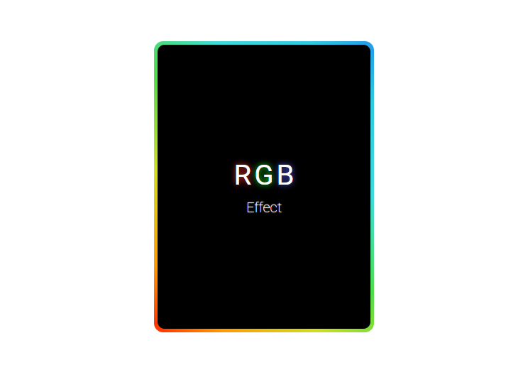

# RGB Effect

### Objective is pratctice CSS
#### :hammer: Techs
-  Hypertext Marckup language
-  Cascading Style Sheet

#### Install :rocket::
`git clone https://github.com/wilandev/card-rgb-effect`

### Result:

